# 🌀 ANIME TYCOON

**Un jeu Roblox de type Tycoon** inspiré de *Grow a Chicken Fighter* et des jeux d'animé récents
(*Defeat Anime Bosses*…) : à la place des poulets, tu collectionnes, entraînes et fais évoluer des
**héros d'animé au format avatar Roblox R6**. À la place des œufs, tu ouvres des **reliques des séries** :
parchemins ninja, doigts maudits, boules de cristal, fruits du démon…

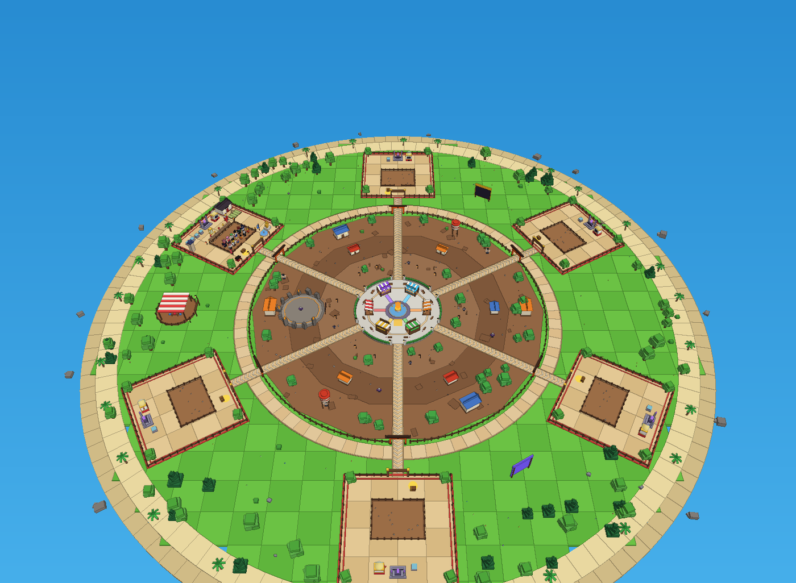

> Toutes les images de ce README sont des rendus réels des modèles du jeu (générés à partir du code, hors Roblox).

---

## 🚀 Lancer le jeu

1. Installe **Roblox Studio** (gratuit).
2. Télécharge le fichier **[`build/AnimeTycoon.rbxl`](build/AnimeTycoon.rbxl)** de ce dépôt.
3. Double-clique dessus (ou *Fichier → Ouvrir* dans Studio).
4. **Tout est déjà visible sans lancer la partie** (voir plus bas), et tu peux le modifier.
5. Clique sur **▶ Play** pour jouer.

**Pour sauvegarder la progression** : publie le jeu (*Fichier → Publier sur Roblox*), puis active
*Paramètres du jeu → Sécurité → « Enable Studio Access to API Services »*. Sans ça, le jeu marche
mais rien n'est sauvegardé (un message te le rappelle en jeu).

---

## ✏️ Modifier le jeu directement dans Studio (sans lancer la partie)

Le fichier contient le jeu **déjà construit**. Dans l'*Explorateur* de Studio :

| Où | Ce que c'est | Ce qui se passe au lancement |
|---|---|---|
| `Workspace › World` | Toute la carte : hub, stands, vendeurs, anneau, arène du boss, chemins, île, bases, coin des échanges | **Gardée telle quelle** : déplace, recolore, ajoute ou supprime ce que tu veux |
| `Workspace › World › Zone › Decor` | Le décor de l'anneau pour le **Village Ninja** | Échangé avec les autres décors toutes les 30 min, **tes retouches sont gardées** |
| `ServerStorage › DecorsUnivers` | Les décors des 4 autres univers | Glisse-en un dans `Workspace › World › Zone` pour le voir, modifie-le, puis remets-le dans `DecorsUnivers` (ne change pas son nom) |
| `Workspace › World › Plots › Plot1` | Une **base d'exemple** avec toutes les améliorations et des persos exposés | Le sol, la clôture, la machine, l'autel… sont gardés. Les améliorations et les persos (aperçu) sont reconstruits pour chaque joueur |
| `Workspace › GaleriePersos` | **Les 40 persos (et leurs évolutions) + les 20 ennemis**, posés sur des socles, au sud de l'île | Le jeu **reprend ces modèles** pour tout le monde : retouche une couleur, un accessoire, une coiffure… et c'est appliqué en jeu |

Astuces :
- Pour remplacer un perso par **ton propre modèle** (fait dans Studio ou avec des objets du catalogue) :
  mets un rig **R6** (avec `HumanoidRootPart`, `Torso`, `Head`, `Left Arm`…) dans
  `GaleriePersos › ModelesPersos` et nomme-le comme le perso : `ninja_maruto`, ou `ninja_maruto_2` /
  `ninja_maruto_3` pour ses évolutions ★★ / ★★★.
- Pour utiliser des **objets du catalogue Roblox** (cheveux, vêtements, visage) sans rien construire :
  colle leurs identifiants dans `src/shared/Config/Avatars.luau` (exemple dans le fichier). Le jeu crée
  alors l'avatar R6 tout seul au démarrage.
- Si tu modifies le look d'un perso dans `Characters.luau`, supprime son modèle de la galerie (ou
  reconstruis le fichier, voir *Pour les développeurs*) pour voir la nouvelle version.

---

## 🗺️ La carte

| Le hub central | Un stand du hub | L'anneau et l'arène du boss |
|---|---|---|
| 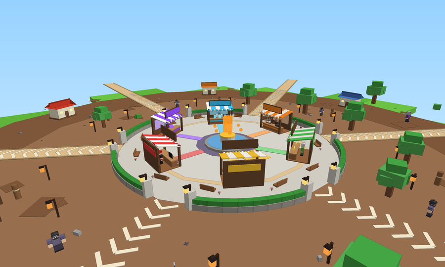 | 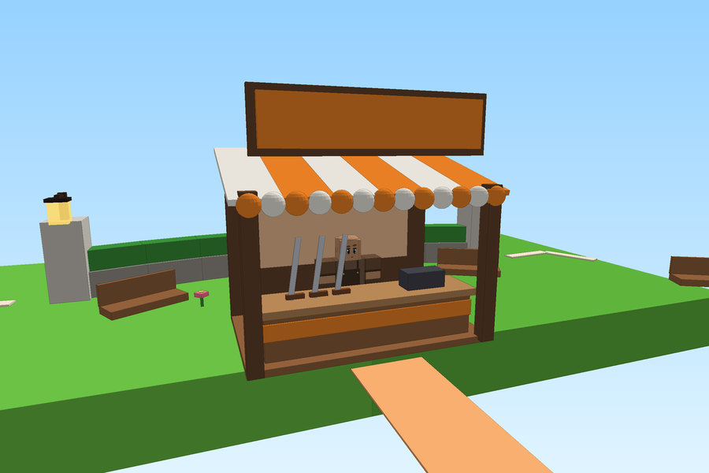 | 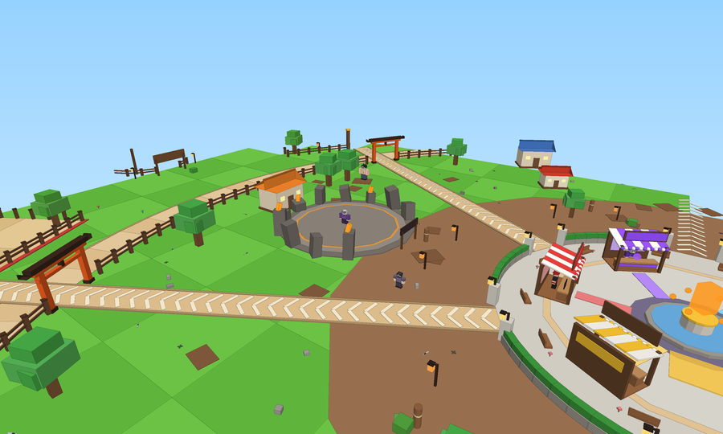 |

- **Au centre, le HUB** (zone sûre) : le cristal d'univers (avec le compte à rebours) et **6 stands** avec leurs vendeurs :
  - ⚔️ **Défi** : téléporte à l'arène du boss · 🌀 **Fusionner** : la Fusion Crossover · 💎 **Traits** : relancer les traits
  - 🗡️ **Forgeron** : acheter des épées · ⭐ **Faire évoluer** les unités · 📖 **Index** : ta collection
- **Autour du hub, l'ANNEAU D'UNIVERS** : la zone de combat. Son décor, ses ennemis, son boss, la lumière et les reliques
  en vente **changent toutes les 30 minutes** (en même temps sur tous les serveurs). Les ennemis faibles sont près du hub,
  les plus forts au bord. L'**arène rocheuse** du boss est dans l'anneau.
- **Autour, les bases des joueurs** (dalles beiges à picots et bandes rouges), reliées au hub par des **chemins à chevrons**,
  le **coin des échanges**, le classement, et l'île entourée de plage et d'océan.

### 🌀 Un nouvel univers toutes les 30 minutes

| Village Ninja | Académie Occulte | Planète des Guerriers |
|---|---|---|
| 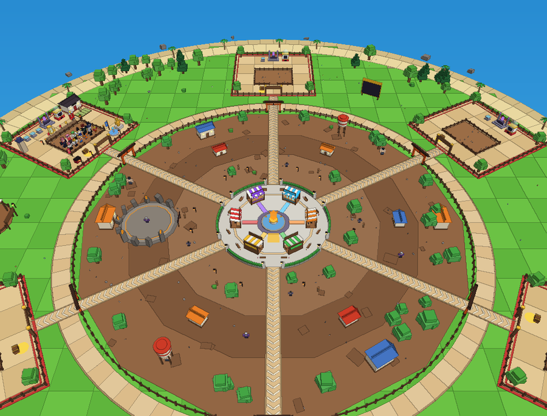 | 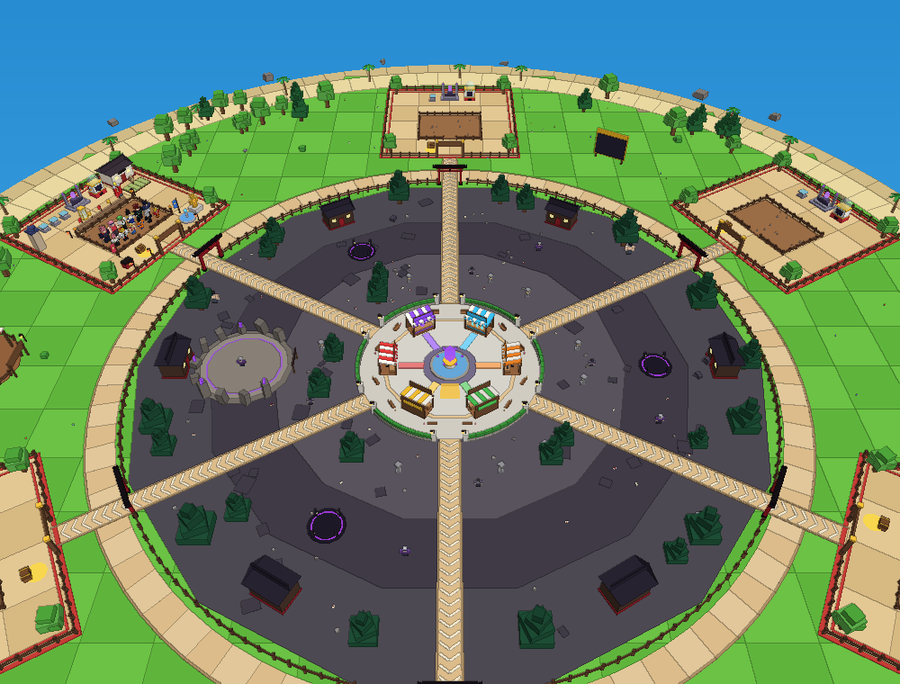 | 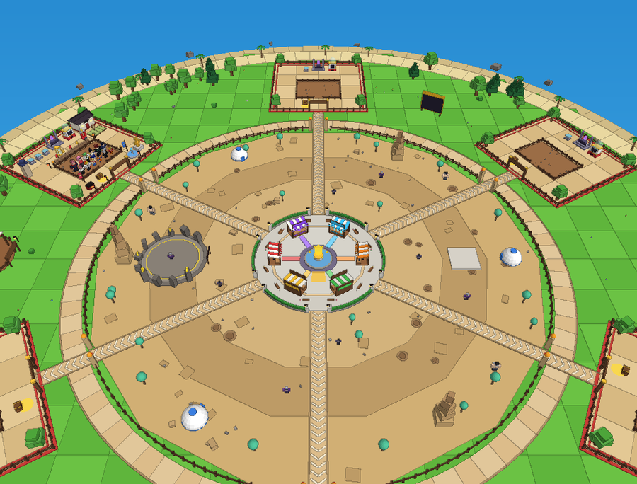 |
| **Grand Océan** | **Ère des Pourfendeurs** | **Ta base (toutes les améliorations)** |
| 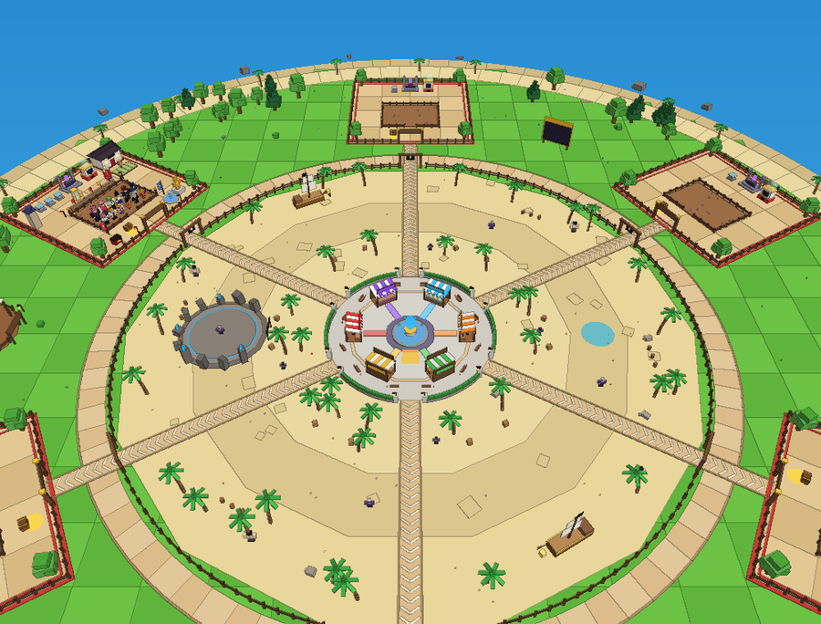 | 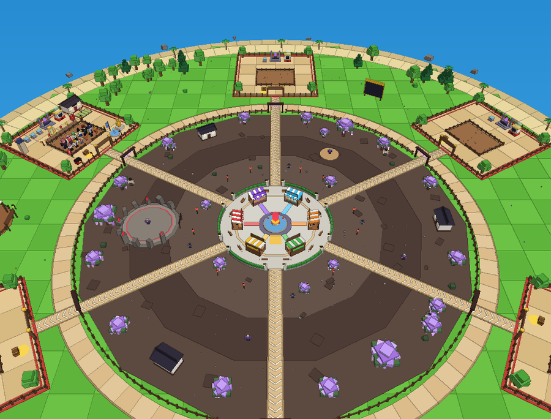 | 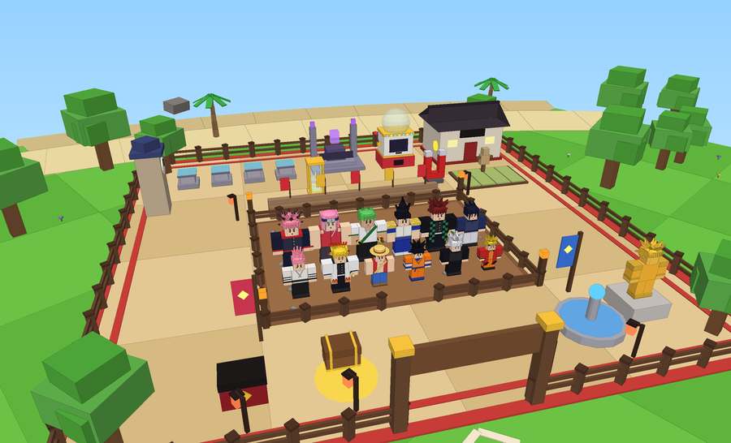 |

---

## 🎮 La boucle de jeu

| Étape | Ce que tu fais |
|---|---|
| 🎁 **Reliques** | La **Machine à Reliques** de ta base vend les reliques de l'univers actuel. Pose-en une sur un **autel** : après quelques secondes, ouvre-la et découvre ton perso (révélation animée, avec parfois une **aura** et un **trait**). |
| ⚔️ **Combat** | Tes persos équipés **te suivent** et attaquent tout seuls dans l'anneau. **Toi aussi tu te bats** : tu commences avec une **Épée Rouillée** toute faible (touche **1** pour la sortir, clic pour frapper). Un **boss** apparaît toutes les 8 minutes dans l'arène. |
| 🗡️ **Forgeron** | Achète de meilleures épées au stand du Forgeron, chacune avec son effet (vent, foudre, flammes, fumée noire, glace…). |
| 📈 **Grandir** | Les persos gagnent de l'XP en combat et en s'entraînant sur ta base. En montant de niveau, ils **grandissent** (comme les poulets !). |
| ✨ **Évoluer** | Au niveau max, fais-les évoluer (★ → ★★ → ★★★) avec les matériaux de **leur** univers. Leur apparence change (mode Ermite, Gear 5, bandeau retiré…). |
| 💎 **Traits** | À l'autel des Traits, dépense un **Cristal de Trait** pour donner un bonus aléatoire à un perso (de Vigueur I à **Monarque**). |
| 🏠 **Tycoon** | Les persos exposés sur ta base remplissent ton **coffre doré**. Marche sur les **boutons verts** pour construire : autels, dojo, fontaine, statue dorée… |
| 🤝 **Échanges** | Au **Coin des Échanges**, assieds-toi à une table : quand un joueur s'assoit en face, l'échange s'ouvre. |
| 🌀 **Fusion** | Au stand **Fusionner**, fusionne deux persos de deux univers différents (la pépite, voir plus bas). |

Les boutons à gauche de l'écran téléportent : **Base, Zone, Troc, Hub, Boss**.

---

## 👥 Les 40 personnages (format avatar R6)

Comme dans les jeux d'animé récents, les persos sont des **avatars Roblox R6** (corps en blocs, animations
officielles de Roblox) avec un **visage d'animé dessiné** (grands yeux brillants, moustaches, cicatrices…),
des **tenues peintes** et des **coiffures en mèches**. Les noms sont légèrement changés pour respecter
les droits d'auteur (Naruto → **Maruto**, Gojo → **Goju**…).

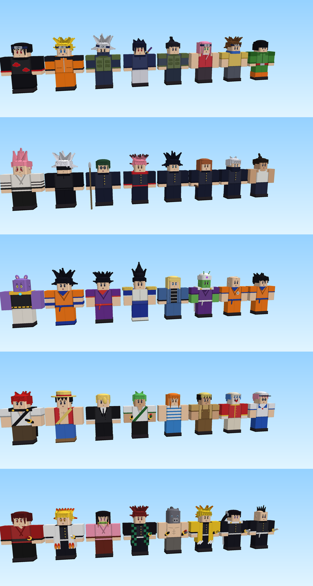

| Univers (inspiration) | Communs | Rares | Épiques | Légendaire | Mythique | Boss |
|---|---|---|---|---|---|---|
| **Village Ninja** (Naruto) | Rok Li, Konohamaro | Sakoura, Shikamaro | Sasuki, Kakashu | **Maruto** | **Itochi** | Kourama |
| **Académie Occulte** (Jujutsu Kaisen) | Toudo, Inumako | Nobora, Megumo | Yuzi, Mako | **Goju** | **Sukana** | Kenjakou |
| **Planète des Guerriers** (Dragon Ball) | Yamcho, Krilin | Piccola, Androïde 81 | Vejeta, Gohon | **Goko** | **Beeros** | Freezo |
| **Grand Océan** (One Piece) | Kobi, Buggi | Usupp, Nomi | Zoru, Sanjo | **Loffy** | **Shonks** | Amiral Akaino |
| **Ère des Pourfendeurs** (Demon Slayer) | Genyo, Kanoa | Zenitso, Inosoke | Tanjiru, Nezoko | **Rengoko** | **Yoriichu** | Akazo |

<details>
<summary>Voir les persos évolués ★★★ et les ennemis</summary>

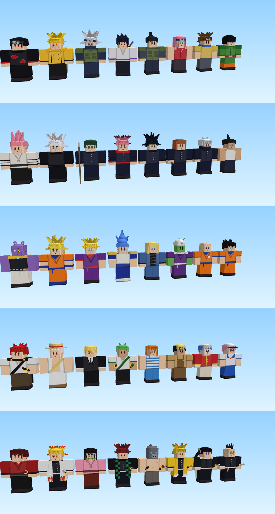

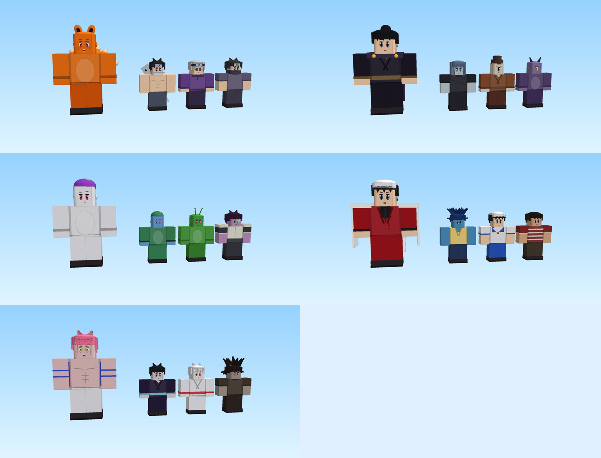
</details>

### 🎁 Les reliques (à la place des œufs)

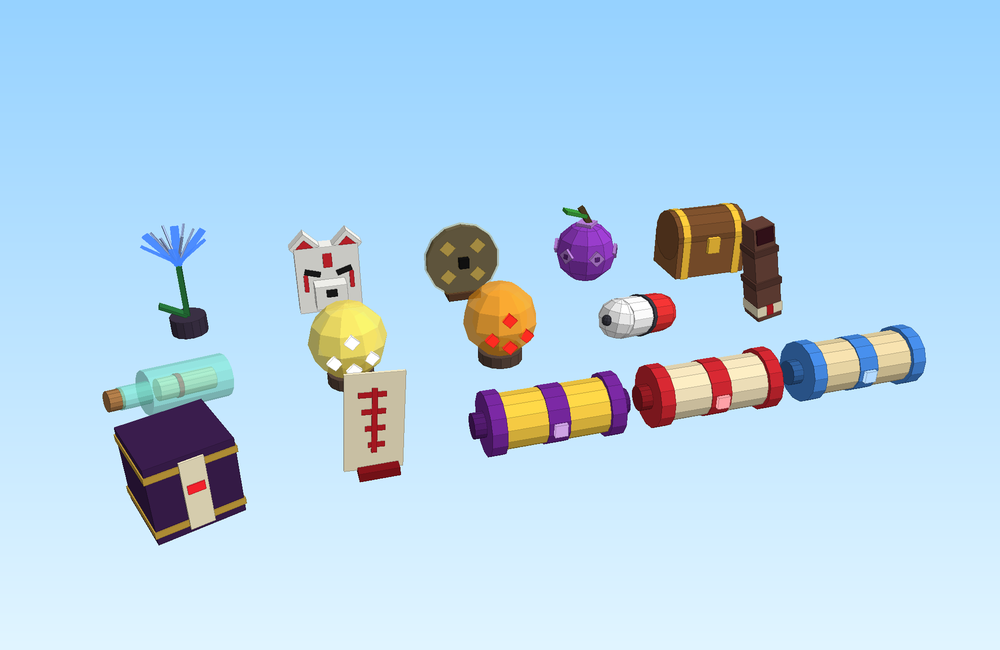

| Palier | Prix | Stock / 5 min | Ouverture | Chances |
|---|---|---|---|---|
| Commune | 150 | 8 | 12 s | Commun 70 % · Rare 25 % · Épique 4,5 % · Légendaire 0,5 % |
| Rare | 2 500 | 3 | 60 s | Commun 25 % · Rare 45 % · Épique 24 % · Légendaire 5,5 % · Mythique 0,5 % |
| Légendaire | 40 000 | 1 (60 % du temps) | 3 min | Rare 20 % · Épique 50 % · Légendaire 25 % · Mythique 5 % |

---

## 💎 Les traits

En plus de son perso, chaque relique a **35 % de chances** de donner un **trait**. Tu peux aussi relancer
le trait d'un perso au stand **Traits** avec un **Cristal de Trait** (2 offerts au départ, en vente à
25 000 pièces, lâchés par les boss et parfois par les ennemis forts).

| Rang | Traits |
|---|---|
| Commun | Vigueur I (+10 % puissance), Célérité I (attaque 10 % plus vite), Érudit (+50 % XP) |
| Rare | Vigueur II, Célérité II, Fortuné (+25 % pièces), Colosse (+60 % PV, plus grand) |
| Épique | Critique (+15 % de critiques), Vigueur III, Célérité III, Vampire (vol de vie) |
| Légendaire | Midas (+100 % pièces), Céleste (+100 % puissance, attaque plus vite) |
| Mythique | **Monarque** (+200 % puissance, +50 % PV, +50 % pièces) |

---

## 🗡️ Les épées du Forgeron

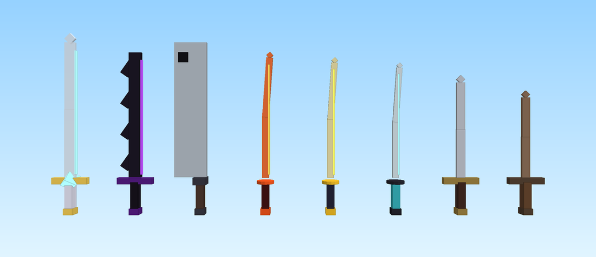

| Épée | Prix | Dégâts | Effet |
|---|---|---|---|
| Épée Rouillée | offerte | 6 | entaille |
| Lame d'Acier | 1 500 | 18 | entaille |
| Katana du Vent | 12 000 | 55 | rafales de vent |
| Lame de Foudre | 60 000 | 160 | éclairs |
| Lame Solaire | 250 000 | 420 | flammes |
| Couperet de la Brume | 900 000 | 1 100 | brume tranchante (grande portée) |
| Lame des Abysses | 3 000 000 | 3 000 | fumée noire |
| Épée Céleste | 12 000 000 | 8 000 | cristaux de glace |

Les attaques des persos ont aussi leurs effets : éclairs bleus, cristaux de glace, fumée noire, orbes,
rayons, flammes, croissants de lame…

---

## 💎 La pépite : la Fusion Crossover

> Ton document laissait une mécanique à inventer. Voici ma proposition, intégrée au jeu (stand **Fusionner** du hub).

Tu fusionnes **deux persos de deux univers différents** (Épique ou mieux, évolués au moins ★★) pour créer un
**perso Crossover unique** : coiffure et visage du premier, tenue du second, nom généré automatiquement.

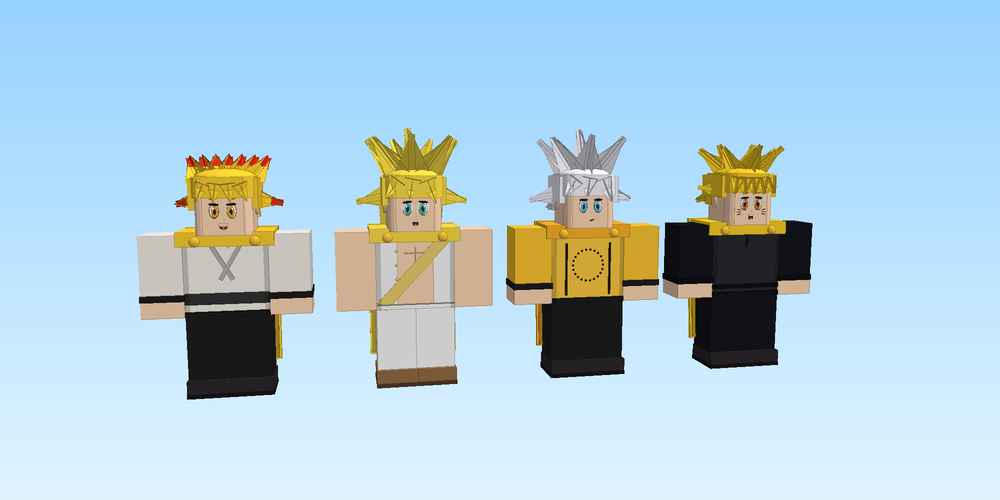

*Exemples : Maruto + Goju = **« Renard de l'Infini »**, Goju + Maruto = **« Infini du Renard »**.*

- Les univers tournent toutes les 30 min : il faut **revenir à plusieurs rotations** pour réunir deux persos compatibles.
- Ça donne une raison forte d'**échanger**.
- **320 combinaisons** à découvrir dans l'Index. Le Crossover hérite de la **meilleure aura** et du **meilleur trait**.

Bonus : **auras** (Foudre, Givre, Flamme, Néant, Doré, Arc-en-ciel) et **événements célestes** toutes les 11 minutes
(Orage Électrique, Éclipse du Néant, Pluie d'Or, Lune de Sang). D'autres idées dans le [document de conception](docs/CONCEPTION.md).

---

## 🏗️ Améliorations de la base (boutons « tycoon »)

| Amélioration | Prix | Effet | | Amélioration | Prix | Effet |
|---|---|---|---|---|---|---|
| Lanternes de Papier | 600 | +10 % revenus | | Autel de Relique #2 | 1 500 | +1 autel |
| Tatami d'Entraînement | 3 000 | +50 % XP | | Arène Agrandie | 12 000 | +4 persos exposés |
| Aimant à Pièces | 7 500 | +25 % pièces de combat | | Bannière d'Équipe #4 | 25 000 | +1 place d'équipe |
| Fontaine de Chakra | 35 000 | +25 % revenus | | Autel de Relique #3 | 50 000 | +1 autel |
| Horloge Mystique | 80 000 | −25 % temps d'ouverture | | Grande Arène | 220 000 | +6 persos exposés |
| Dojo Légendaire | 150 000 | +100 % XP | | Autel de Relique #4 | 450 000 | +1 autel |
| Coffre du Shogun | 300 000 | +50 % pièces de combat | | Bannière d'Équipe #5 | 600 000 | +1 place d'équipe |
| Statue Dorée | 900 000 | +50 % revenus | | Sablier Divin | 1 500 000 | −25 % temps d'ouverture |

---

## 🛠️ Personnaliser par le code

| Je veux… | Fichier |
|---|---|
| Renommer un perso, changer ses couleurs, sa coiffure, sa tenue, ses accessoires, ses évolutions | `src/shared/Config/Characters.luau` |
| Donner à un perso des objets du catalogue Roblox (cheveux, vêtements, visage) | `src/shared/Config/Avatars.luau` |
| Changer les épées du Forgeron | `src/shared/Config/Swords.luau` |
| Changer les traits | `src/shared/Config/Traits.luau` |
| Changer les univers, reliques, ennemis, ambiance lumineuse | `src/shared/Config/Universes.luau` |
| Changer les prix, la durée des univers (30 min), les boss, les améliorations | `src/shared/Config/Economy.luau` |
| Changer la taille du hub, de l'anneau, la place des stands | `src/shared/Config/Layout.luau` |
| Changer les raretés ou les auras | `src/shared/Config/Rarities.luau`, `src/shared/Config/Auras.luau` |
| Ajouter des admins | `ADMINS` dans `src/server/Services/AdminService.luau` |

### Pour les développeurs (Rojo)

Le code source est dans `src/` et se synchronise avec [Rojo](https://rojo.space) (`rojo serve`).
Pour reconstruire le fichier livré, avec la carte, les décors et la galerie déjà construits dedans :

```bash
rojo build default.project.json -o build/_rojo.rbxl
ANIME_PLACE=build/_rojo.rbxl lune run tools/bake.luau build/AnimeTycoon.rbxl
```

Vérifications : `selene src`, `stylua src tests`, et les tests Lune :
`lune run tests/smoke.luau`, `lune run tests/integration.luau`, `lune run tests/client_smoke.luau`.

| Dossier | Contenu |
|---|---|
| `src/shared/Config` | Toutes les données du jeu (persos, univers, économie, épées, traits, disposition de la carte) |
| `src/shared/Modules` | `CharacterBuilder` (persos R6), `Painter` (visages et tenues dessinés), `CharacterFactory` (modèles perso / catalogue), `SwordBuilder`, `RelicBuilder`, formules |
| `src/server/World` | Construction de la carte (`WorldBuilder`) et des décors d'univers (`UniverseDecor`) |
| `src/server/Services` | Les services du serveur (données, bases, combat, épées, hub, traits, fusion, échanges…) |
| `src/client` | Interface (menus, HUD, révélations), animations des persos, effets visuels |
| `tools/bake.luau` | Pré-construit le jeu dans le fichier `.rbxl` (pour le voir et le modifier dans Studio) |
| `tests` | Tests automatiques Lune (serveur, client, construction) |
